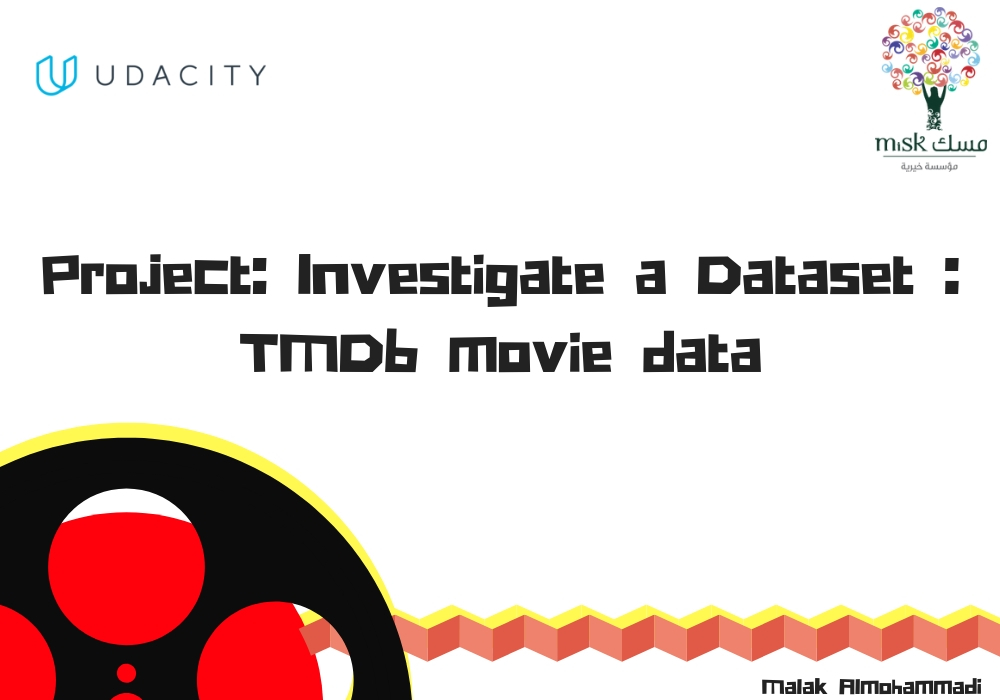
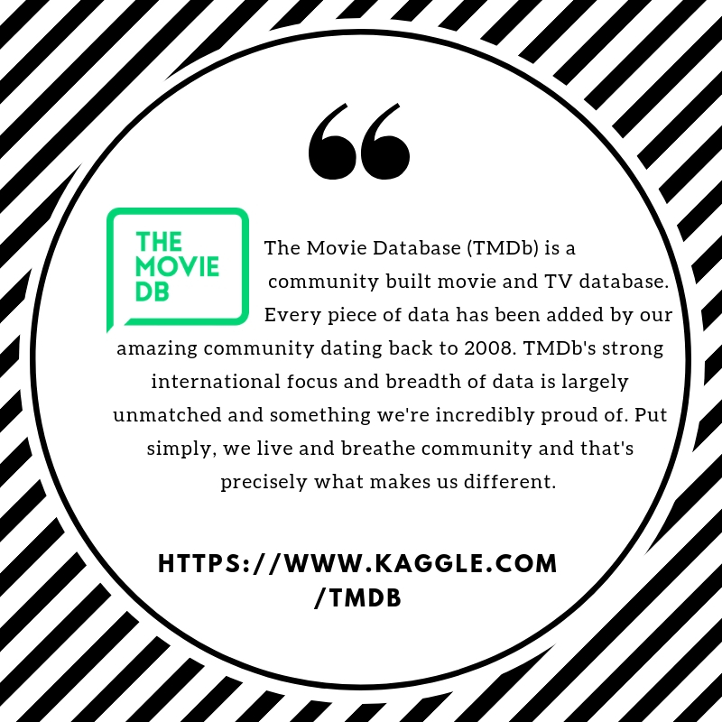
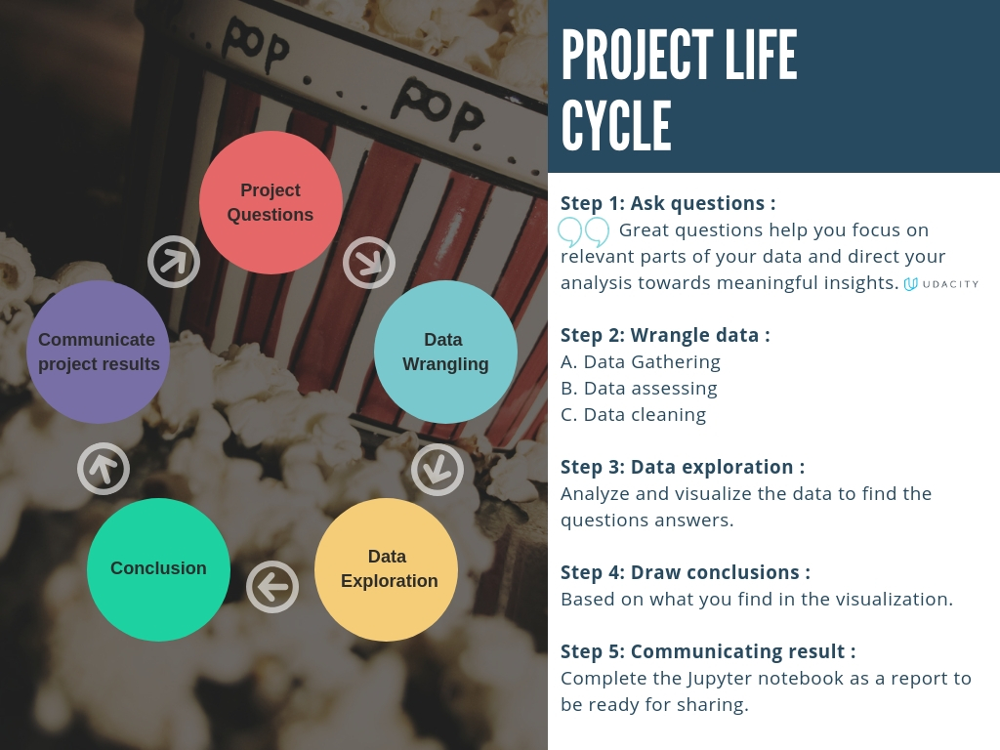
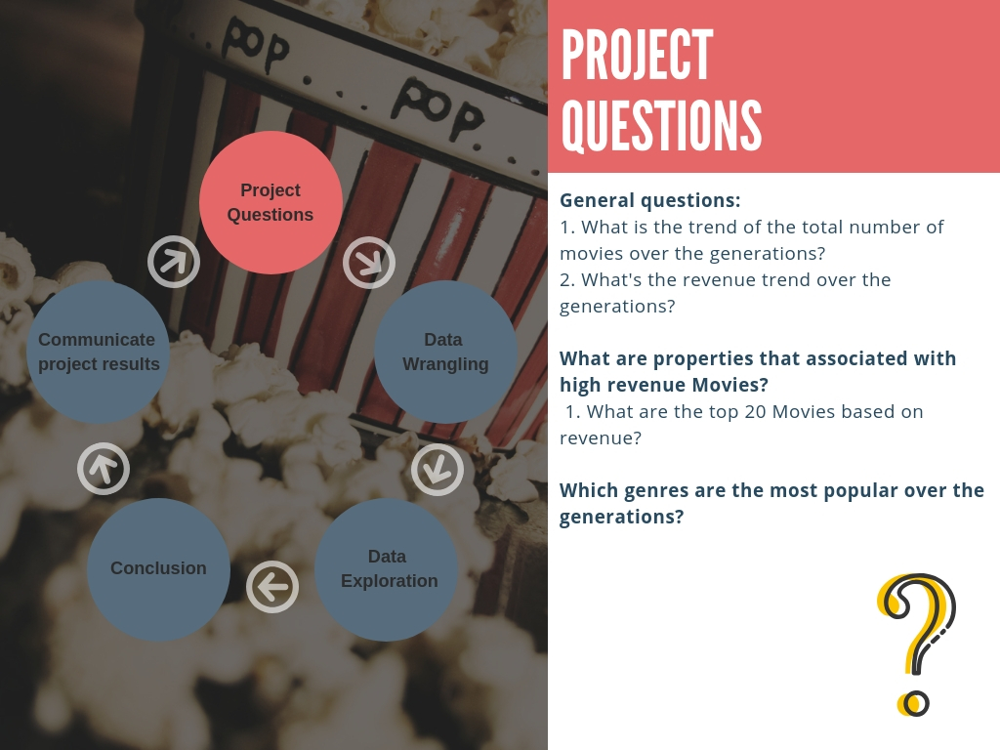
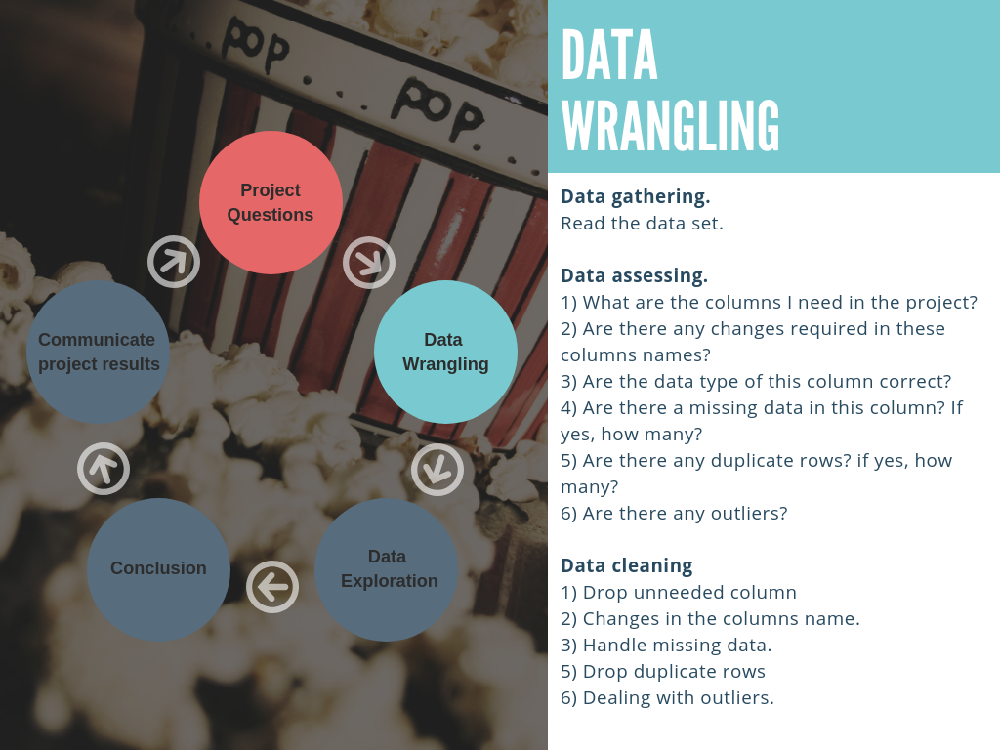
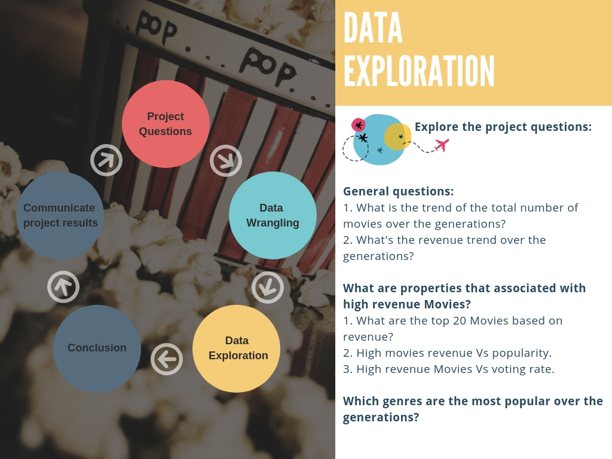
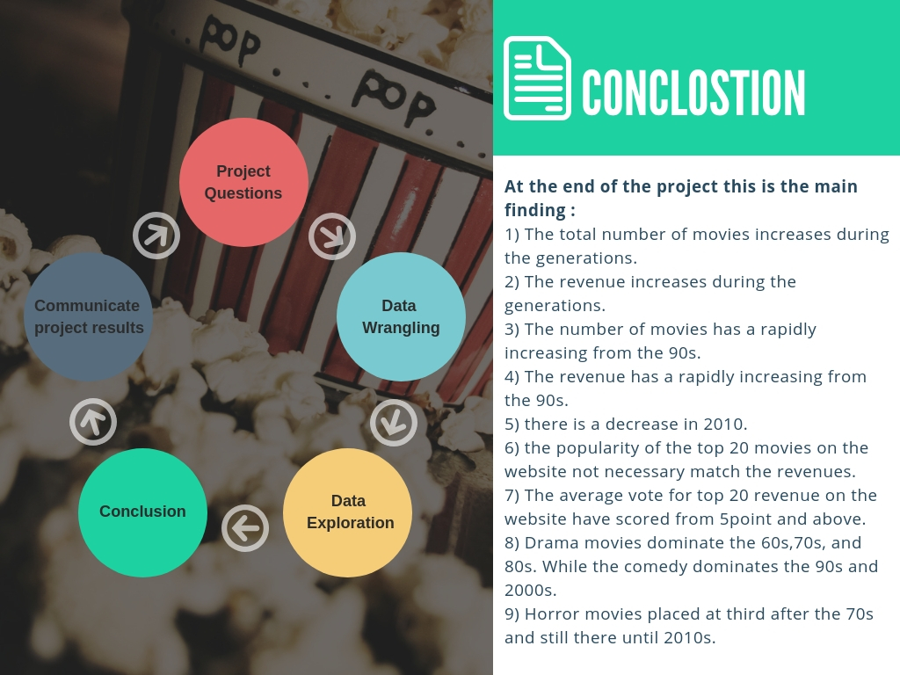
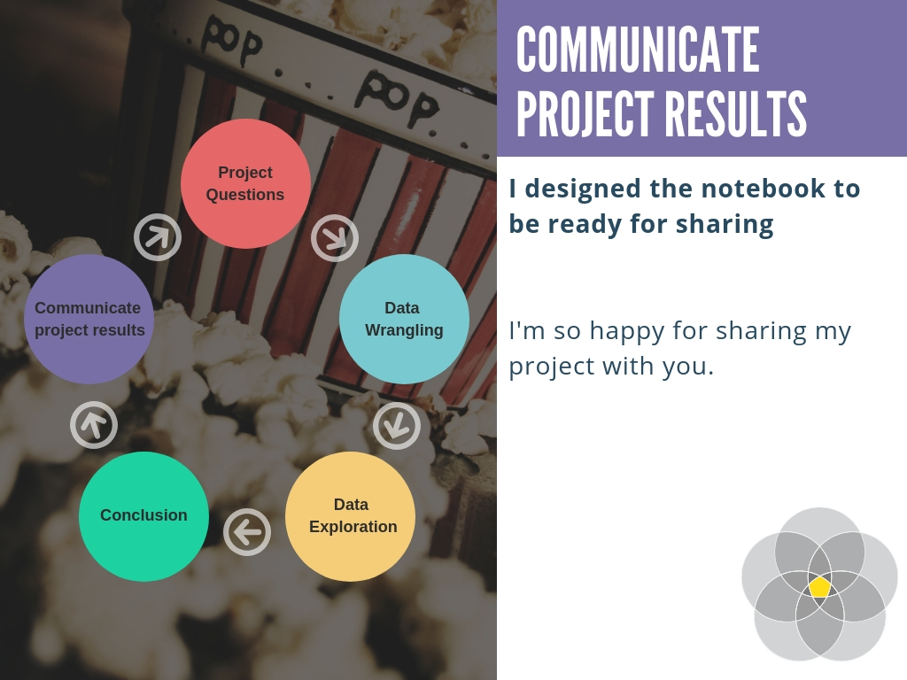

  

# Analyze-TMDb-Movie-Data.

## Description
### About the project
In this project, I have to choose any one Dataset for investigation out of 5. [Click here](https://docs.google.com/document/d/e/2PACX-1vTlVmknRRnfy_4eTrjw5hYGaiQim5ctr9naaRd4V9du2B5bxpd8FEH3KtDgp8qVekw7Cj1GLk1IXdZi/pub?embedded=True) to open a document with links and information about datasets that I can investigate for this project.

### Why I chose this dataset? 
I have chosen TMDb Movie Data for my Investigation in this project because this marketplace is new in Saudi Arabia after the cinema opening in 2018.

### What needs to be done
For this project, I will conduct my own data analysis and create a file to share my findings. I will start by taking a look at the dataset and brainstorm what questions I could answer using it. Then I will use pandas and NumPy to answer the questions that I am most interested in, and create a report sharing the answers. I have not been required to use inferential statistics or machine learning to complete this project, but I will make it clear in my communications that my findings are tentative. This project is open-ended in that they aren't looking for one right answer.

### Why this project
In this project, I'll go through the data analysis process and see how everything fits together. I'll use the Python libraries NumPy, pandas, and Matplotlib which make writing data analysis code in Python a lot easier! Not only that, these are sought-after skills by employers!

### File Descriptions
    ./Data/ contains the various datasets
    ./Investigate_a_Dataset.ipynb is a Jupyter notebook containing the work I have done
    ./Investigate_a_Dataset.pdf is an exported version of the above file using LaTeX
    ./Source/ contains the project images.

### About Dataset 

  

  

  

  

  

  

  

#### All images desined using [Canva](http://https://www.canva.com) 
#### Popcorn photography [Click](https://backgroundsphotography.wordpress.com/2011/03/01/time-for-popcorn/)
